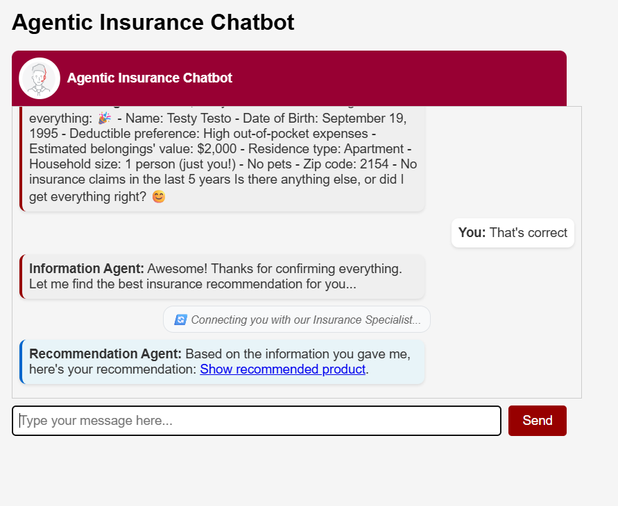

# 🤖 Agentic Insurance Chatbot

> **An intelligent 2-agent system that enables insurance recommendations through specialized AI agents and seamless handoff mechanisms.**



This system demonstrates a simple agentic AI architecture where two specialized agents collaborate to deliver personalized insurance recommendations. Each agent has a distinct role and expertise, creating a natural conversation flow that mimics human insurance consultation.

---

## 🎯 Key Concepts

### The Dual-Agent Architecture

Our system employs **two specialized AI agents** that work in perfect harmony:

**💻 Information Agent**
- Conducts structured conversations to gather customer information
- Validates completeness of 9 essential data points, including customer age
- Provides friendly, conversational experience
- Signals when ready for handoff

**💻 Recommendation Agent** 
- Processes customer data to generate personalized recommendations
- Utilizes advanced product matching algorithms
- Delivers recommendations with direct product links
- Focuses on concise, actionable advice

### Agent Handoff Flow


---

## ✨ Features

🎭 **Visual Agent Identity**: Each agent has distinct styling and clear labels in the UI
🔄 **Animated Handoff Sequence**: Beautiful step-by-step visualization showing agent transition progress
📊 **Structured Data Collection**: Validates 9 essential customer data points before recommendation
🎯 **Personalized Recommendations**: Advanced matching based on deductible, coverage, and water backup preferences
⚡ **Session Persistence**: Firestore-backed conversation storage that survives page refreshes and instance restarts
💾 **Smart Session Management**: Three-tier system (Qualtrics → localStorage → generated) for reliable session tracking
🔗 **Direct Product Links**: Actionable recommendations with immediate purchase options
🎨 **Responsive UI**: Modern design with smooth animations and mobile-friendly interface  

---

## 🚀 Quick Start

### Prerequisites
- Python 3.10+
- Docker (recommended)
- OpenAI API key

### 1. Setup & Configuration
```bash
git clone <repository-url>
cd agentic-insurance-chatbot

# Configure environment
cp .env.example .env
# Edit .env with your OPENAI_API_KEY
```

### 2. Run with Docker (Recommended) 
```bash
docker-compose up --build
```

### 3. Run with Python
```bash
pip install -r requirements.txt
uvicorn core.application:app --host 0.0.0.0 --port 8001 --reload
```

### 4. Access the System
- **Local UI**: http://localhost:8000/ui
- **API Documentation**: http://localhost:8000/docs
- **Health Check**: http://localhost:8000/health

---

## 🏗️ System Architecture

```
FastAPI Application
├── 💻 Information Agent          ┌─ Collects customer data
│   ├── Structured conversation   │  ├─ Age, preferences
│   ├── Data validation          │  ├─ Residence, household info  
│   └── Handoff trigger          │  └─ Insurance history
│                                │
├── 🔄 Agent Handoff System      ┌─ Seamless transitions
│   ├── Signal detection         │  ├─ JSON data extraction
│   ├── Data validation          │  ├─ Customer data validation
│   └── UI transition messages   │  └─ Visual handoff indicators
│                                │
└── 💻 Recommendation Agent      ┌─ Generates recommendations
    ├── Customer data processing │  ├─ Advanced product matching
    ├── OpenAI function calling  │  ├─ Deductible & coverage analysis
    └── Product link generation  │  └─ HTML recommendation links
```

---

## 📚 Documentation

For comprehensive information about this system:

📋 **[WORKFLOW.md](docs/WORKFLOW.md)** - Complete workflow documentation with detailed diagrams and UI features
🔧 **[TECHNICAL_REFERENCE.md](docs/TECHNICAL_REFERENCE.md)** - Extensive technical documentation covering all functions, API calls, and data flows
🤖 **[AGENT_SYSTEM.md](docs/AGENT_SYSTEM.md)** - Detailed agent system reference with prompts and handoff mechanisms
📈 **[SCALING_GUIDE.md](SCALING_GUIDE.md)** - Production deployment and scaling guide for 1000+ concurrent requests
📖 **API Documentation** - Available at `/docs` when running the application  

---

## 🌐 Integration & Deployment

### Qualtrics Integration
This system is designed for seamless Qualtrics integration:
- Upload `static/ST01_UI_simple_decline_handoff.js` (simple accept/decline) or `static/UI_for_qualtrics.js` (with product gallery) as an embedded code block
- Configure embedded data fields for conversation storage and analytics
- Update `chatbotURL` variable in the script with your deployment endpoint

#### Required Embedded Data Variables
Add these variables to your Qualtrics Survey Flow before the chatbot question:

**Core Variables:**
- `ChatHistory` - Conversation log (text format)
- `ChatHistoryJson` - Structured conversation data (JSON)
- `SessionId` - Session identifier (auto-managed by 3-tier system)
- `ResponseID` - Qualtrics response ID

**Analytics Variables:**
- `RecommendedProduct` - Initially recommended product number
- `AcceptedProduct` - Product user accepted
- `WasRecommendationAccepted` - "true"/"false"
- `UserJourney` - User interaction flow (e.g., "direct-accept", "decline-only")
- `RecommendationType` - Interaction type (e.g., "single", "gallery")
- `RejectedRecommendation` - Rejected product number
- `DeclinedProduct` - Declined product number

**Timestamp Variables (optional but recommended):**
- `WINDOW_OPEN_TS` - When the chatbot page loaded
- `INIT_MSG_TS` - When initial message was sent
- `FIRST_MSG_TS` - When user sent first message
- `NEXT_CLICK_TS` - When user clicked Next button

*Leave all values empty - JavaScript will populate them automatically.*

### Google Cloud Authentication & Setup
```bash
# Login to Google Cloud (no browser mode)
gcloud auth login --no-browser

# Configure Docker for Artifact Registry
gcloud auth configure-docker GCLOUD_AREA
```

### Google Cloud Run Deployment
```bash
# Build image locally
docker build -t agentic-insurance-chatbot .

# Tag for Artifact Registry
docker tag agentic-insurance-chatbot GCLOUD_AREA/YOUR_PROJECT_ID/agentic-insurance/agentic-insurance-chatbot:latest

# Push to Artifact Registry
docker push GCLOUD_AREA/YOUR_PROJECT_ID/agentic-insurance/agentic-insurance-chatbot:latest

# Deploy to Cloud Run
gcloud run deploy agentic-insurance-chatbot \
  --image GCLOUD_AREA/YOUR_PROJECT_ID/agentic-insurance/agentic-insurance-chatbot:latest \
  --platform managed \
  --region europe-west1 \
  --set-env-vars OPENAI_API_KEY=your_key \
  --set-env-vars WORKERS=4 \
  --set-env-vars ENABLE_CONVERSATION_STORAGE=false \
  --set-env-vars ENABLE_FIRESTORE_STORAGE=true \
  --set-env-vars GOOGLE_CLOUD_PROJECT=YOUR_PROJECT_ID \
  --allow-unauthenticated
```

### Environment Configuration
```bash
# CRITICAL - Required for application to function
OPENAI_API_KEY=your_openai_api_key

# OPTIONAL - Conversation Storage
ENABLE_CONVERSATION_STORAGE=false  # Enable GCS logging for analysis
ENABLE_FIRESTORE_STORAGE=true      # Enable Firestore for session persistence (recommended)
GOOGLE_CLOUD_PROJECT=your_project_id
GCS_BUCKET_NAME=your_bucket_name   # defaults to "insurance-chatbot-logs"

# OPTIONAL - Performance Configuration
WORKERS=1   # Number of uvicorn workers (1 for debugging, 4+ for production)
PORT=8080   # Application port (default: 8080)
```

---

## 🎪 What Makes This Special?

This isn't just another chatbot - it's a **demonstration of agentic AI architecture** where:

🤝 **Agents collaborate** rather than compete  
🎯 **Each agent has specialized expertise** and clear responsibilities  
🔄 **Handoff mechanisms are seamless** and user-friendly  
📊 **Structured data flows** ensure quality recommendations  
🎨 **Visual design** makes agent transitions clear and engaging  

Perfect for research, education, and production deployment of multi-agent AI systems.

---

## 📄 License

MIT License - Feel free to use this project for research, education, or commercial purposes.
