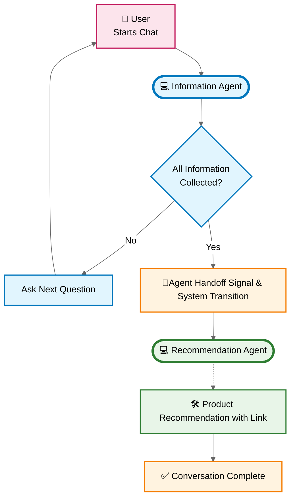

# 🤖 Agentic Insurance Chatbot

> **An intelligent 2-agent system that revolutionizes insurance recommendations through specialized AI agents and seamless handoff mechanisms.**


This system demonstrates cutting-edge agentic AI architecture where two specialized agents collaborate to deliver personalized insurance recommendations. Each agent has a distinct role and expertise, creating a natural conversation flow that mimics human insurance consultation.

---

## 🎯 Key Concepts

### The Dual-Agent Architecture

Our system employs **two specialized AI agents** that work in perfect harmony:

**💻 Information Agent** (Data Collection Specialist)
- Conducts structured conversations to gather customer information
- Validates completeness of 9 essential data points
- Provides friendly, conversational experience
- Signals when ready for handoff

**💻 Recommendation Agent** (Insurance Specialist) 
- Processes customer data to generate personalized recommendations
- Utilizes advanced product matching algorithms
- Delivers recommendations with direct product links
- Focuses on concise, actionable advice

### Agent Handoff Flow



---

## ✨ Features

🎭 **Visual Agent Identity**: Each agent has distinct styling and clear labels in the UI  
🔄 **Seamless Handoff**: Smooth transitions with system messages like "🔄 Connecting you with our Insurance Specialist..."  
📊 **Structured Data Collection**: Validates 9 essential customer data points before recommendation  
🎯 **Personalized Recommendations**: Advanced matching based on deductible preferences and coverage needs  
⚡ **Real-time Processing**: Multi-message responses with appropriate delays for natural conversation flow  
🔗 **Direct Product Links**: Actionable recommendations with immediate purchase options  

---

## 🚀 Quick Start

### Prerequisites
- Python 3.10+
- Docker (recommended)
- OpenAI API key

### 1. Setup & Configuration
```bash
git clone <repository-url>
cd agentic-insurance-chatbot

# Configure environment
cp .env.example .env
# Edit .env with your OPENAI_API_KEY
```

### 2. Run with Docker (Recommended) 
```bash
docker-compose up --build
```

### 3. Run with Python
```bash
pip install -r requirements.txt
uvicorn core.application:app --host 0.0.0.0 --port 8000 --reload
```

### 4. Access the System
- **Local UI**: http://localhost:8000/ui
- **API Documentation**: http://localhost:8000/docs
- **Health Check**: http://localhost:8000/health

---

## 🏗️ System Architecture

```
FastAPI Application
├── 💻 Information Agent          ┌─ Collects customer data
│   ├── Structured conversation   │  ├─ Name, DOB, preferences
│   ├── Data validation          │  ├─ Residence, household info  
│   └── Handoff trigger          │  └─ Insurance history
│                                │
├── 🔄 Agent Handoff System      ┌─ Seamless transitions
│   ├── Signal detection         │  ├─ JSON data extraction
│   ├── Data validation          │  ├─ Customer data validation
│   └── UI transition messages   │  └─ Visual handoff indicators
│                                │
└── 💻 Recommendation Agent      ┌─ Generates recommendations
    ├── Customer data processing │  ├─ Advanced product matching
    ├── OpenAI function calling  │  ├─ Deductible & coverage analysis
    └── Product link generation  │  └─ HTML recommendation links
```

---

## 📚 Documentation

For comprehensive information about this system:

📋 **[WORKFLOW.md](WORKFLOW.md)** - Complete workflow documentation with detailed diagrams and UI features  
🔧 **[TECHNICAL_REFERENCE.md](TECHNICAL_REFERENCE.md)** - Extensive technical documentation covering all functions, API calls, and data flows  
📖 **API Documentation** - Available at `/docs` when running the application  

---

## 🌐 Integration & Deployment

### Qualtrics Integration
This system is designed for seamless Qualtrics integration:
- Upload `static/UI_for_qualtrics.js` as an embedded code block
- Configure embedded data fields for conversation storage
- Update `chatbotURL` with your deployment endpoint

### Google Cloud Run Deployment
```bash
# Build and deploy
docker build -t gcr.io/YOUR_PROJECT_ID/agentic-insurance-chatbot .
docker push gcr.io/YOUR_PROJECT_ID/agentic-insurance-chatbot

gcloud run deploy agentic-insurance-chatbot \
  --image gcr.io/YOUR_PROJECT_ID/agentic-insurance-chatbot \
  --set-env-vars OPENAI_API_KEY=your_key
```

### Environment Configuration
```bash
# Required
OPENAI_API_KEY=your_openai_api_key

# Optional - Storage & Analytics
ENABLE_CONVERSATION_STORAGE=false
GOOGLE_CLOUD_PROJECT=your_project_id
GCS_BUCKET_NAME=your_bucket_name
```

---

## 🎪 What Makes This Special?

This isn't just another chatbot - it's a **demonstration of agentic AI architecture** where:

🤝 **Agents collaborate** rather than compete  
🎯 **Each agent has specialized expertise** and clear responsibilities  
🔄 **Handoff mechanisms are seamless** and user-friendly  
📊 **Structured data flows** ensure quality recommendations  
🎨 **Visual design** makes agent transitions clear and engaging  

Perfect for research, education, and production deployment of multi-agent AI systems.

---

## 📄 License

MIT License - Feel free to use this project for research, education, or commercial purposes.