# Agentic Insurance Chatbot - Workflow Documentation

## System Overview

This is a **2-agent insurance recommendation system** that uses specialized AI agents to collect customer information and provide personalized insurance recommendations. The system uses a structured handoff mechanism to seamlessly transfer conversations between agents.

### Core Architecture
- **Agent 1 (Information Collector)**: Conducts structured conversations to gather customer data
- **Agent 2 (Recommendation Agent)**: Processes collected data to generate insurance recommendations
- **Frontend**: Provides visual indicators and multi-message support for smooth agent transitions

## Agent Workflow

### Phase 1: Information Collection
The Information Collector Agent gathers 9 required data points:
1. Customer name and date of birth
2. Deductible preference (high/low out-of-pocket expenses)
3. Belongings value estimation
4. Residence type (apartment, house, etc.)
5. Household size
6. Pet information
7. Zip code
8. Previous insurance claims history

### Phase 2: Agent Handoff
When all information is collected, Agent 1:
1. Provides brief acknowledgment: *"Perfect! I have everything I need. Let me find the best insurance recommendation for you..."*
2. Signals handoff with: `HANDOFF_TO_RECOMMENDATION_AGENT`
3. Includes structured JSON data with customer information

### Phase 3: Recommendation Generation
Agent 2 receives the customer data and:
1. Processes preferences and risk factors
2. Calls insurance product recommendation function
3. Returns concise response with product link: *"Based on the information you gave me, here's your recommendation: [LINK]"*

## Technical Implementation

### Handoff Mechanism
```python
# Agent 1 signals completion
if info_collector.should_handoff(response):
    customer_data = info_collector.extract_collected_data(response)
    # Immediately process recommendation
    recommendation = process_with_recommendation_agent(customer_data)
    return [transition_message, recommendation_message]
```

### Multi-Message Response
The system returns an array of messages during handoff:
- **Message 1**: Information Agent's transition message
- **Message 2**: Recommendation Agent's product recommendation

### UI Features
- **System Message**: "🔄 Connecting you with our Insurance Specialist..." appears between agents
- **Visual Indicators**: Different colors and labels for each agent
  - Information Agent: Gray background with red border
  - Recommendation Agent: Light blue background with blue border
- **Smooth Transitions**: 1-second delays between messages for natural flow

### Overall System Flow

```mermaid
graph TD
    A[User Starts Chat] --> B[Information Agent]
    B --> C{All 9 Fields Collected?}
    C -->|No| D[Ask Next Question]
    D --> A
    C -->|Yes| E[Agent Handoff Signal]
    E --> F[🔄 System Transition Message]
    F --> G[Recommendation Agent]
    G --> H[Product Recommendation with Link]
    H --> I[Conversation Complete]
```



### Agent Handoff Sequence

```mermaid
sequenceDiagram
    participant U as User
    participant IA as Information Agent
    participant S as System
    participant RA as Recommendation Agent
    
    U->>IA: "Yes" (confirms all data)
    IA->>S: "Perfect! Let me find..." + HANDOFF_SIGNAL + JSON
    S->>U: Display transition message
    S->>U: Show "🔄 Connecting..." indicator  
    S->>RA: Process customer data immediately
    RA->>S: "Based on info, here's recommendation: [LINK]"
    S->>U: Display recommendation with agent styling
```



### UI Multi-Message Flow

```mermaid
graph LR
    A[API Response Array] --> B[Message 1: Info Agent]
    B --> C[1 sec delay]
    C --> D[System Message: 🔄 Connecting...]
    D --> E[1 sec delay]
    E --> F[Message 2: Recommendation Agent]
    F --> G[Different Visual Styling]
```



## Running the System

### Local Development
```bash
# Start the server
uvicorn core.application:app --reload

# Access UI
http://localhost:8000/ui
```

### Key Configuration
- **OpenAI Model**: GPT-4o for both agents
- **Port**: Configurable via `PORT` environment variable (default: 8080)
- **Storage**: Optional Google Cloud Storage for conversation logs

### Environment Variables
```bash
OPENAI_API_KEY=your_api_key
PORT=8080
ENABLE_CONVERSATION_STORAGE=false
```

## Key Features

- **Intelligent Handoff**: Automatic detection when all required information is collected
- **Visual Agent Identity**: Clear indicators showing which agent is active
- **Structured Data Collection**: Validated JSON format for customer information
- **Responsive UI**: Real-time message display with appropriate delays
- **Error Handling**: Robust validation and fallback mechanisms
- **Conversation Logging**: Optional persistent storage for analysis

## System Benefits

1. **Specialized Expertise**: Each agent focuses on its core competency
2. **Improved User Experience**: Clear transitions and visual feedback
3. **Data Quality**: Structured validation ensures complete information
4. **Scalability**: Modular design allows easy agent modifications
5. **Research-Friendly**: Comprehensive logging for conversation analysis