# Agentic Insurance Chatbot - Workflow Documentation

## System Overview

This is a **2-agent insurance recommendation system** that uses specialized AI agents to collect customer information and provide personalized insurance recommendations. The system uses a structured handoff mechanism to seamlessly transfer conversations between agents.

### Core Architecture
- **Agent 1 (Information Collector)**: Conducts structured conversations to gather customer data
- **Agent 2 (Recommendation Agent)**: Processes collected data to generate insurance recommendations
- **Frontend**: Provides visual indicators and multi-message support for smooth agent transitions

## Agent Workflow

### Phase 1: Information Collection
The Information Collector Agent:
1. **Initial Acknowledgment**: Welcomes user and explicitly states it's an AI assistant for rental insurance, checking for any questions
2. **Gathers 9 required data points in this order**:
   - Residence type (apartment, house, etc.)
   - Household size
   - Pet information
   - Zip code
   - Previous insurance claims history
   - Customer age (confirm it is a number)
   - Deductible preference (high/low out-of-pocket expenses)
   - Belongings value estimation
   - Water backup coverage preference for sewers/drains (yes/no)

### Phase 2: Agent Handoff
When all information is collected, Agent 1:
1. Provides brief acknowledgment: *"Perfect! I have everything I need. Let me find the best insurance recommendation for you..."*
2. Signals handoff with: `HANDOFF_TO_RECOMMENDATION_AGENT`
3. Includes structured JSON data with customer information

### Phase 3: Recommendation Generation
Agent 2 receives the customer data and:
1. Processes preferences and risk factors (deductible, coverage, water backup)
2. Calls insurance product recommendation function with 3 parameters
3. Returns concise response with product link: *"Based on the information you gave me, here's your recommendation: [LINK]"*

## Technical Implementation

### Handoff Mechanism
```python
# Agent 1 signals completion
if info_collector.should_handoff(response):
    customer_data = info_collector.extract_collected_data(response)
    # Immediately process recommendation
    recommendation = process_with_recommendation_agent(customer_data)
    return [transition_message, recommendation_message]
```

### Multi-Message Response
The system returns an array of messages during handoff:
- **Message 1**: Information Agent's transition message
- **Message 2**: Recommendation Agent's product recommendation

### UI Features

#### Visual Agent Identification
- **Information Agent**: Light gray background (`#F0F1F9`) with purple border, labeled "Information Agent"
- **Recommendation Agent**: Light blue background (`#E8F4F8`) with blue border, labeled "Recommendation Agent"
- **Agent Type Tracking**: Each message includes explicit `agent_type` field ("collector" or "recommendation")

#### Handoff Divider System
The system provides two types of handoff visualizations:

**1. Animated Handoff Sequence** (Real-time handoffs)
- Appears during live agent transitions
- 3-step animated visualization:
  - Step 1: "Handing over to Insurance Specialist" (200ms delay)
  - Step 2: "Thinking" (3750ms delay in ST02)
  - Step 3: "Getting top recommendation" (6000ms delay in ST02)
- Each step appears sequentially with completion checkmarks
- Smooth animations with color-coded progress indicators
- **Total duration: ~10.8 seconds for complete sequence (ST02 current timing)**
- Note: ST01 may use different timing values

**2. Static Handoff Divider** (Conversation history)
- Appears when loading previous conversations
- Shows completed handoff with all steps marked done
- Indicates: "Handoff Complete - Routed to Insurance Specialist"
- Allows users to see where agent transition occurred

#### Session Persistence
- **Firestore Integration**: Conversations persist across page refreshes and server restarts
- **Smart Session Management**: Three-tier system ensures reliable session tracking:
  1. **Qualtrics Embedded Data** (highest priority): Uses Qualtrics SessionId if available
  2. **localStorage Fallback**: Uses browser localStorage for session continuity
  3. **Generated ID**: Creates new session using `crypto.randomUUID()` or fallback
- **Conversation Recovery**: Automatically loads and renders previous messages on page refresh
- **Handoff Detection**: System correctly identifies and displays handoff dividers in loaded history

### Complete Agent-Focused Application Flow

```mermaid
%%{init:{ "theme":"neutral" }}%%
flowchart TB
    A["👤 User<br>Starts Chat"] --> B(["💻 Information Agent"])
    B --> C{"All Information<br>Collected?"}
    C -- No --> D["Ask Next Question"]
    D --> A
    C -- Yes --> E["🔄Agent Handoff Signal & System Transition"]
    E --> G(["💻 Recommendation Agent"])
    G -.-> H["🛠️ Product Recommendation with Link"]
    H --> I["✅ Conversation Complete"]

    %% classes (2 px strokes by default)
    classDef infoAgent fill:#e1f5fe,stroke:#0277bd,stroke-width:2px,color:#000
    classDef recoAgent fill:#e8f5e8,stroke:#2e7d32,stroke-width:2px,color:#000
    classDef system    fill:#fff3e0,stroke:#f57c00,stroke-width:2px,color:#000
    classDef user      fill:#fce4ec,stroke:#c2185b,stroke-width:2px,color:#000

    class A user
    class B infoAgent
    class C infoAgent
    class D infoAgent
    class E system
    class G recoAgent
    class H recoAgent
    class I system

    %% heavier outlines for the two focus nodes
    style B stroke-width:4px
    style G stroke-width:4px


### Agent Handoff Sequence

```mermaid
sequenceDiagram
    participant U as User
    participant IA as Information Agent
    participant S as System
    participant RA as Recommendation Agent
    
    U->>IA: "Yes" (confirms all data)
    IA->>S: "Perfect! Let me find..." + HANDOFF_SIGNAL + JSON
    S->>U: Display transition message
    S->>U: Show "🔄 Handing off → Recommendation Agent" indicator  
    S->>RA: Process customer data immediately
    RA->>S: "Based on info, here's recommendation: [LINK]"
    S->>U: Display recommendation with agent styling
```

### UI Multi-Message Flow

```mermaid
graph LR
    A[API Response Array] --> B[Message 1: Info Agent]
    B --> C[1 sec delay]
    C --> D[System Message: 🔄 Handing off → Recommendation Agent]
    D --> E[1 sec delay]
    E --> F[Message 2: Recommendation Agent]
    F --> G[Different Visual Styling]
```



## Running the System

### Local Development
```bash
# Start the server
uvicorn core.application:app --reload

# Access UI
http://localhost:8000/ui
```

### Key Configuration
- **OpenAI Model**: GPT-4o for both agents
- **Port**: Configurable via `PORT` environment variable (default: 8080)
- **Storage**: Optional Google Cloud Storage for conversation logs

### Environment Variables
```bash
OPENAI_API_KEY=your_api_key
PORT=8080
WORKERS=1  # Number of uvicorn workers (1 for dev, 4+ for prod)
ENABLE_CONVERSATION_STORAGE=false       # Optional GCS logging
ENABLE_FIRESTORE_STORAGE=true           # Enable Firestore persistence (recommended)
GOOGLE_CLOUD_PROJECT=your_project_id    # Required for Firestore
```

## Key Features

- **Intelligent Handoff**: Automatic detection when all required information is collected
- **Animated Handoff Visualization**: Beautiful step-by-step transition animation between agents
- **Visual Agent Identity**: Clear color-coded indicators showing which agent is active
- **Structured Data Collection**: Validated JSON format for customer information with explicit agent_type tracking
- **Session Persistence**: Firestore-backed conversation storage survives page refreshes and server restarts
- **Smart Session Management**: Three-tier session ID system (Qualtrics → localStorage → generated)
- **Conversation Recovery**: Automatically loads and renders previous conversations with handoff dividers
- **Responsive UI**: Real-time message display with appropriate delays and smooth animations
- **Error Handling**: Robust validation and fallback mechanisms
- **Conversation Logging**: Optional persistent storage for analysis (GCS)

## System Benefits

1. **Specialized Expertise**: Each agent focuses on its core competency
2. **Improved User Experience**: Clear transitions and visual feedback
3. **Data Quality**: Structured validation ensures complete information
4. **Scalability**: Modular design allows easy agent modifications
5. **Research-Friendly**: Comprehensive logging for conversation analysis